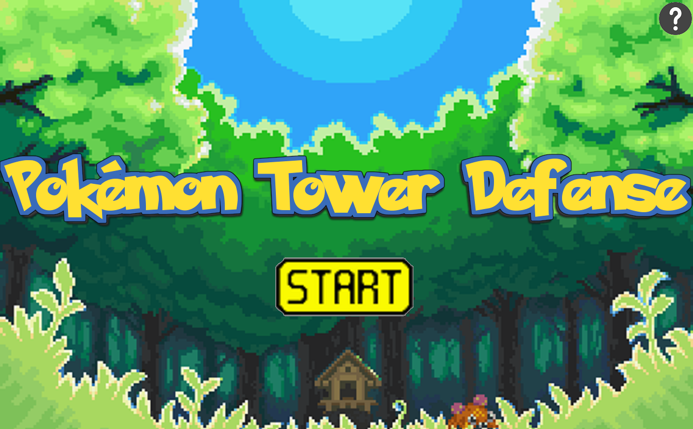
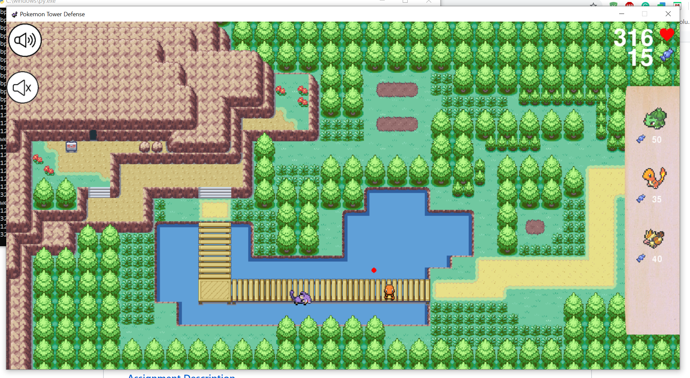
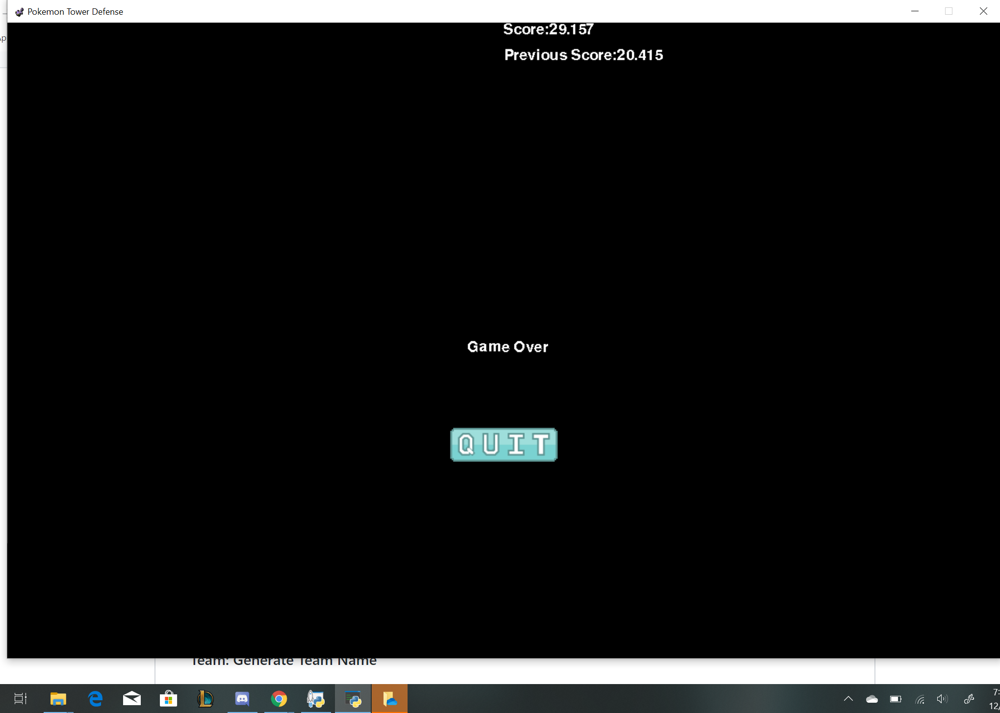
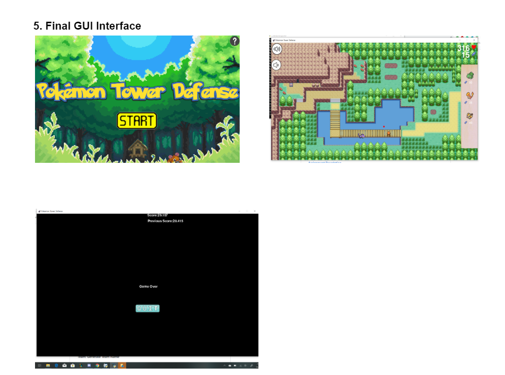
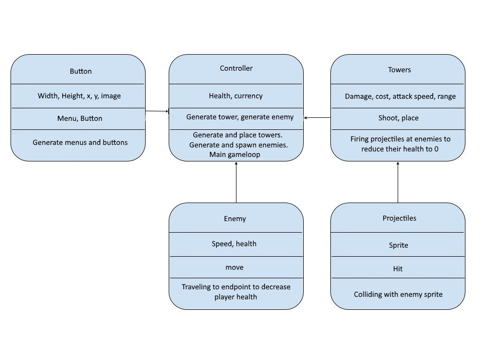

:warning: Everything between << >> needs to be replaced (remove << >> after replacing)

#  Pokemon Tower Defense 
## CS 110 Final Project
###  Fall, 2019 
### [Assignment Description](https://drive.google.com/open?id=1HLIk-539N9KiAAG1224NWpFyEl4RsPVBwtBZ9KbjicE)

https://github.com/bucs110/final-project-fall19-generate_team_name
 
https://docs.google.com/presentation/d/14Ej6djvl0_gFQkJLmgFJ08NCayA8_-3Og2ds4BgdDOA/edit?usp=sharing

### Team:  Generate Team Name 
#### Stanley Lin, Brian Ni, Steven Yeung 

***

## Project Description
 Pokemon Defense Tower is a tower defense game and the primary objective of the game is to clear waves of enemies before the user runs out of health, HP. The User will start with 600 HP.The enemies will consist of Rattatas, purple rat, and they will run from one end of the map to the other end, but the user will buy pokemon towers from the store. Each Pokemon tower inflict a different amount of damage to the enemies and each Pokemon tower will have a different range and projectile. Once the enemies enter the range of a tower, the tower will start attacking it until the enemy is dead or if it leaves the range of the tower. The enemies will come in waves and the user will have access to stop time and go to the store to buy more towers or to upgrade the tower. As the game progresses, the waves will include more and more enemies as the number of waves increases. If the enemies reaches the opposite end of the map, then the user’s HP will decrease. Each enemy that reaches the end of the path will decrease the user's HP by 1. Once the user’s HP reaches 0, the game will end and it will bring the user to the “GAME OVER” screen. 
***    

## User Interface Design

* <b>Main Menu/Start Screen</b>
    * This will be the first thing that the user sees when he/she opens up the file. The user will have the option to click on the “Start” button to start the game. The will also get the option to read the instructions by clicking the “?”.
    
    
* <b>The Game Screen</b>
    * This screen is where the actual game of tower defense takes place. The user will have the ability to build towers by clicking on the picture of the pokemon tower in the store, right side of screen, and then clicking somewhere on the map. Enemies will spawn from the cave and follows a path that ends on the right side of the map. However, the towers that the user built will fire projectiles at the enemies if they enter the range of the tower. If the enemies reaches the end of the path, the user’s health will decrease. There will be three waves of enemies total. .
    
    
* <b>Game Over Menu</b>
    * This screen appears when the user’s HP reaches 0. At that point, the game over menu will pop up and the user will have the option to “PLAY AGAIN” or “quit”.
    

* Final GUI
    

***        

## Program Design
* Non-Standard libraries
    * <b>Pygame</b> 
        * https://www.pygame.org/
        * A module set incorporating many common game development functions into python, developed by Pete Shinners and Pygame Community. Includes crucial graphical elements as well as a musical playback functionality.
    * <b>Time</b>
        *  https://docs.python.org/3/library/time.html
        * A module used to handle time-related tasks
    * <b>Random</b>
        * https://docs.python.org/3/library/random.html
        *  This module generates a random integer or float based on the given range. 
    * <b>Os</b>
        * https://docs.python.org/3/library/os.path.html
        * A module that provides functions for interacting with the operating system. It also provides a portable way of using operating system dependent functionality.
    * <b>Threading</b>
        * https://docs.python.org/3/library/threading.html
        * A module that gets multiple tasks running simultaneously.  

        
        
* Class Interface Design
    *  A simple drawing that shows the class relationships in your code.
        * 
   
* Classes
    * <b>projectile</b>- A class that defines the collision between the enemy and the projectile- a picture of a certain move that the Pokemon Tower. If the projectile comes in contact with the enemy, then the enemy will take damage.
    * <b>pokemonTower</b>- A class that defines the tower- a Pokemon that will be placed in a certain box on the map with the distinct purpose of shooting projectiles and depleting the enemies’ health within the range of the tower. The Tower itself can not die or take damage and it will automatically shoot at the enemy once they in range.However, the tower will have the ability to evolve and their range and the damage that they inflict on the enemies will increase as well. 
    * <b>Button</b>- A class that defines the creation of the buttons in the game
    * <b>Enemies</b>- A class that defines a moving target that follows a set path. The projectile will hit the enemy is it comes into range of the Pokemon Tower. When the projectile from the tower hits the enemy, their health will decrease and once their health/HP reaches 0, the enemy will disappear. This class initialize the enemy and gives it the health,speed, and appearance of the enemies. 
    * <b>controller</b>- This class defines the height and weight of the screen. It draws the map, candy, health, and the store that is located on the right side of the Game Screen. Scales the pictures on the game screen and plays music. 
    * <b>startScreen</b>- A class that defines the animates and size of the starting screen. It creates a gif that shows the background of the Start Screen going from sunrise and sunset. It also displays the Start button.
    * <b>startScreen</b>- A class that defines the animates and size of the starting screen. It creates a gif that shows the background of the Start Screen going from sunrise and sunset. It also displays the Start button.
    * <b>instructionScreen</b>- Class that displays a pop up of the instruction if the user continuously click on the “?” button.
    * <b>Over</b>- A class that defines what happens in the Game Over Screen.
   

***

## Tasks and Responsibilities
* You must outline the team member roles and who was responsible for each class/method, both individual and collaborative.

### Software Lead -  Steven Yeung 

Worked as an integration specialist by helping organize the code for the main game into the proper MVC format, which allowed all portions of the code to be run from a single file. His duties also includes creating tests and making the ATP. He is tasked with making any final decisions that the front end and back end can’t decide on. He worked very closely with the back end to develop the high-score database functionality. He is in charged with updating the proposal and making sure that the code implemented works. In addition, he works closely with the Back End Specialist to ensure that the design of the game in terms of code makes sense. He also works with the Front End Specialist to make sure the GUI design of the map matches up with what the Back End Specialist’s plans. Such plans include making boxes to indicate where the user can place a tower. At the end, he should ensure that both the code written by the Front End and Back End align with each other. 

### Front End Specialist -  Stanley Lin 

Front-end lead conducted significant research on using pygame and paint to create visual aspects such as buttons and on-screen text along with the map, home screen, and game over screen. He used this information to design and program a consistent UI to help the player navigate the title screen, the “YOU WIN”, and the “GAME OVER” screen. He is charged with creating the display of the map and Start and Game Over screen. The map will be where the majority of the game will take place. In addition to that, the Front End Specialist and the Back End Specialist will work together with making sure that the GUI and the code align with each other. He will also create buttons, such as the “BACK” button and the “?” button to allow the user access to going back to the Start Menu and the Instruction Menu

### Back End Specialist -  Brian Ni 

The back end specialist helped with making the class and the methods needed. His duties involves making the methods allowing the enemies take damage from the towers, allowing the Pokemon Tower the ability to evolve/upgrade, etc.. He implements major classes that would be used in the main game, as well as implementing major pygame functionality into each of them. He also made headway in major game mechanics such as the making the user take damage if the enemies reaches the end of the map. He also implemented a currency in the game which allows the Pokemon Tower to be upgraded and become stronger. He collaborated with the Front End Specialist in the implementation of the classes into our Controller file.

## Testing
* Testing Strategy 
    * Starting Screen Testing
        * First, we run Controller() and ensure the main menu opens normally, and there are two buttons available, START and ?.  Next, we click the “?” button to ensure that a pop up of the instructions will appear and the buttons are working as expected. We also check to see if the music plays in the main menu. We also check to see if the music plays in the main menu. Also, in the Start Screen, the background will change from sunrise to sunset on repeat. In the instruction page, it should present the instructions and if we click on the back button it’ll bring the User back to the Start Screen. Afterwards, we test that both of the QUIT buttons on the Main Menu and Instructions Menu properly close the game.We then test the START buttons on the Start Screen to make sure that the Game screen opens properly. 
    * Game Testing
        * When the Game screen boots up , we test if the shopping function works. To do that, we clicked on the picture of the Pokemon on the right side of the screen and then click on the box in the map that indicate where the user can build the tower. From there, we start the game and to test if the enemies spawn from the entrance of the cave. Once the enemies enter the range of the tower,the tower will shoot projectiles at the enemies and damages them, then the test passes. Each enemies that get killed gives the user candy. If the enemies went through all of the towers and reaches the end of the intended path, the user will take one damage for each enemy that reaches the end of the path/map. There is a tracker located on the top right side of the screen to track the amount of health/ candy that the user have. If the User evolves/upgrades or buy towers, then the candy will decrease. If the User kills the enemies, the candy will increase.  From here, we conduct normal playtesting to ensure that the collisions, the speed of the projectile and enemies are all working together meaningfully and without any obvious error, especially in regards that the projectile inflict damage on the enemy even if no contact were made between the two. We also check to make sure the music plays throughout. If the User’s Health reaches 0, the game will bring the User to the Game Over Screen. The “QUIT” button will close the program. There will be one buttons available,QUIT. This concludes the testing protocol. 

* Your ATP

| Step                  | Procedure     | Expected Results  | Actual Results |  Pass?  |  
| ----------------------|:-------------:| -----------------:| -------------- |---------|
|  1  | Run Controller()  | Main Menu opens normally and is functional. The music plays when the game is opened. The background will also change, sunrise to sunset|  |  |
|  2  | Spam Click “?” button  | A pop up with the instruction will appear. |      |      |
|  3  | Click “Start” button on Main Menu| Game screen opens and music continues to play.|    |   |
|  4  | Click on Pokemon Tower in shop on the right side of the Game Screen and then click on a location where a box is present( can only build towers on boxes)| Builds the Pokemon Tower at the location of the box that the user clicked on. User can only build the Tower if he/she have enough Candy(in game currency)|    |   |
|  5  | Click on a Pokemon Tower on the Game Screen that a user purchased. | A pop-up will appear and it will be the cost to upgrade that specific tower and EVOLVE button. If User chooses to upgrade tower, the sprite of the tower will change.  |   |   |
|  6  | Test Pokemon Tower | When upgraded/evolved, the sprite of the tower will change. Tower shoots at enemies once enemies enter the tower’s range. Can be built only in boxes indicated on game screen  |   |   |
|  7  | General playtesting  |  Game starts when the user clicks on the Start button. All the towers are functioning. User have the ability to shop(right side of screen). Enemies spawn and follows the indented path on the map. Candy/ in game currency and health of the user appears on the top right corner of the screen |  |  |
|  8  |Test enemy functions in game screen  | If enemies killed, User gains 10 Candy. Enemies follow the intended path. If enemies reaches the end of the intended path, user’s health will decrease by 1 |  |  |
|  9  |  Health and Candy Tracker  |  Starts with 50 Candy and 600 Health. Candy and Health tracker l keeps track of user's health and candy. For every enemy killed, user gains 10 candy. Candy will decrease if user buy tower or evolve/upgrade tower. Health will be deducted for each enemy that reaches the end of the intended path. |  |   |
|  10  |  Force fail state |  GAME OVER Menu pops up.There will be a QUIT button to ask the user if he/she wants to quit. |  |  |
|  11  | Click the QUIT button in the middle of the screen(For Game Over Screen). | game closes out properly  |  |  |
